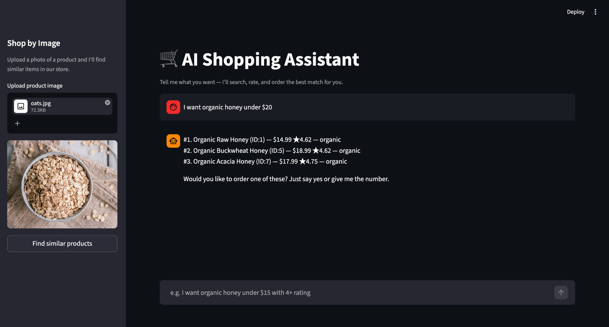
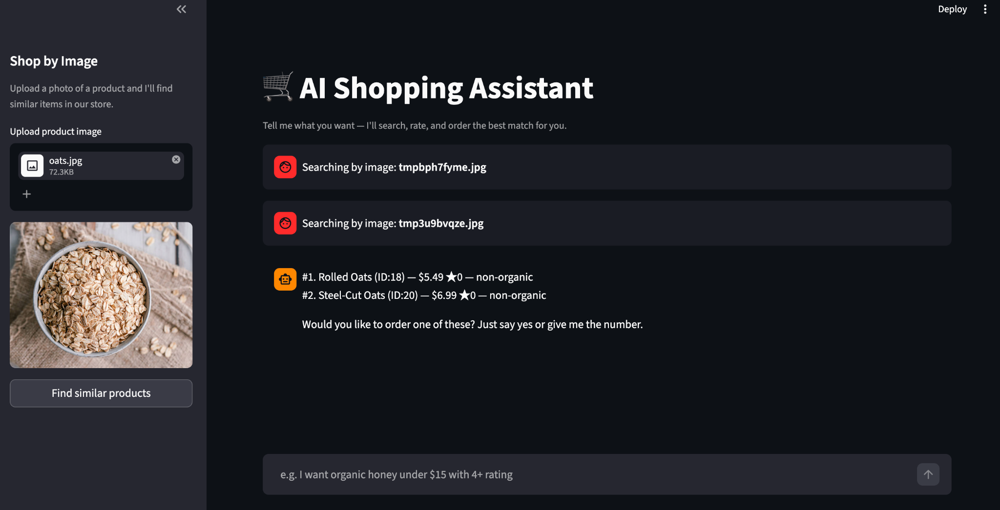

# 🛒 AI Shopping Assistant

AI Shopping Assistant is a smart shopping application built with Python, Streamlit, LangChain, and Groq LLMs. Users can search products using natural language or uploaded images, while the AI agent recommends products, retrieves details, and autonomously places orders.

---

## 🚀 Features

- AI-powered shopping assistant
- Natural language product search
- Shop by image functionality
- Product recommendations
- Autonomous order placement
- Real-time product retrieval
- Streamlit interactive UI
- Tool-calling AI agents

---

## 📸 Application Preview

### Product Search Assistant



---

### Shop By Image Feature



---

## 🧠 Technologies Used

- Python
- Streamlit
- LangChain
- LangGraph
- Groq API
- HuggingFace Embeddings
- Scikit-learn Vector Store

---

## 📦 Installation

Clone the repository:

```bash
git clone https://github.com/yourusername/your-repo-name.git
cd your-repo-name
```

Create virtual environment:

```bash
uv venv --python 3.11
source .venv/bin/activate
```

Install dependencies:

```bash
uv sync
```

---

## 🔑 Environment Variables

Create a `.env` file:

```env
GROQ_API_KEY=your_api_key_here
```

---

## ▶️ Run Application

```bash
streamlit run app.py
```

---

## 💬 Example Queries

- Find wireless earbuds under $100
- Recommend a gaming mouse with RGB lighting
- Find similar products from uploaded image

---

## 📚 Learning Outcomes

This project demonstrates:

- AI Agents
- Tool Calling
- Prompt Engineering
- Streamlit Development
- RAG Concepts
- AI Workflow Orchestration

---

## 👨‍💻 Author

Carlos Kipkoech